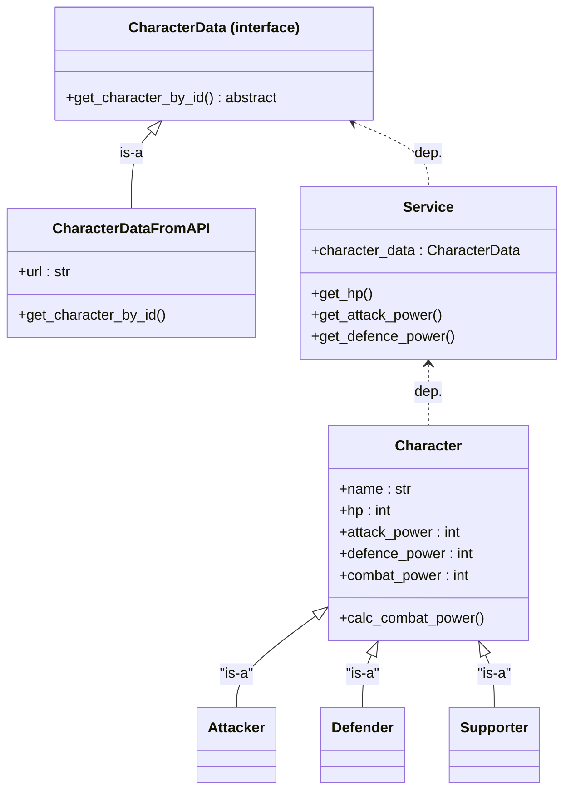

# クラス図

```mermaid
classDiagram

class CharacterData ["CharacterData (interface)"] {
    +get_character_by_id() abstract
}

class CharacterDataFromAPI {
    +url : str
    +get_character_by_id()
}

class Service {
    +character_data : CharacterData
    +get_hp()
    +get_attack_power()
    +get_defence_power()
}

class Character {
    +name : str
    +hp : int
    +attack_power : int
    +defence_power : int
    +combat_power : int
    +calc_combat_power()
}

class Attacker

class Defender

class Supporter

CharacterData <|-- CharacterDataFromAPI : is-a
CharacterData <.. Service : dep.

Service <.. Character : dep.

Character <|-- Attacker : "is-a"
Character <|-- Defender : "is-a"
Character <|-- Supporter : "is-a"

```
