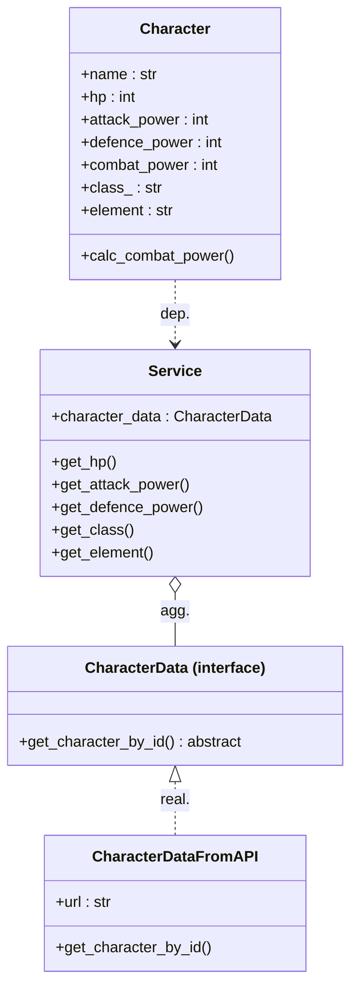

# クラス図

```mermaid
classDiagram

class CharacterData ["CharacterData (interface)"] {
    +get_character_by_id() abstract
}

class CharacterDataFromAPI {
    +url : str
    +get_character_by_id()
}

class Service {
    +character_data : CharacterData
    +get_hp()
    +get_attack_power()
    +get_defence_power()
    +get_class()
    +get_element()
}

class Character {
    +name : str
    +hp : int
    +attack_power : int
    +defence_power : int
    +combat_power : int
    +class_ : str
    +element : str
    +calc_combat_power()
}

Character ..> Service : dep.
Service o-- CharacterData : agg.
CharacterData <|.. CharacterDataFromAPI : real.

```
